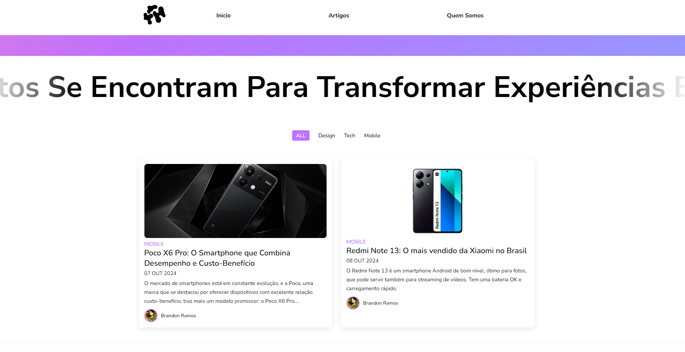

NOM
Bem-vindo à NOM, sua fonte confiável para as últimas novidades e análises detalhadas do mundo da tecnologia. Nosso objetivo é simplificar o complexo e ajudar você a tomar decisões informadas sobre smartphones, gadgets e muito mais.

Recursos
Artigos: Explore uma variedade de conteúdos sobre tecnologia e inovações. 

O NOM é uma aplicação web que fornece uma plataforma para explorar as últimas inovações em tecnologia. Com uma interface responsiva e fácil de usar, os usuários podem filtrar artigos e postagens sobre diversos tópicos, como smartphones e gadgets.

Tecnologias Utilizadas
HTML: Estrutura da página
CSS: Estilização
JavaScript (jQuery): Interatividade e filtragem de postagens

Funcionalidades
Filtragem de Postagens: Os usuários podem filtrar postagens com base em categorias como "Todos", "Design", "Tech" e "Mobile".
Animações Suaves: Transições animadas ao exibir ou ocultar postagens.
Responsividade: O layout se adapta a diferentes tamanhos de tela, proporcionando uma boa experiência em dispositivos móveis e desktop.

Contribuição
Sinta-se à vontade para contribuir para o projeto. Faça um fork do repositório e envie um pull request com suas alterações.

Redes Sociais
Conecte-se conosco nas redes sociais:

TikTok
Instagram
Twitter

